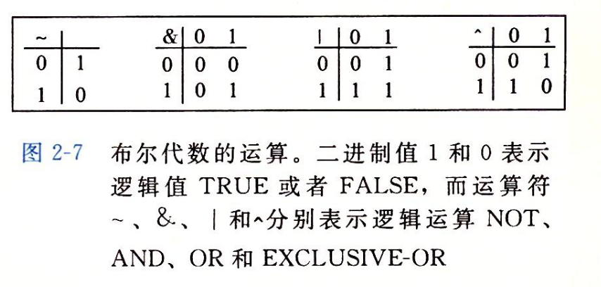

- #+BEGIN_PINNED
  Bryant, Randal E., and David R. O’Hallaron. 深入理解计算机系统. Translated by 龚奕利 and 贺莲. Third Edition. Beijing: 机械工业出版社, 2016.p35-37
  #+END_PINNED
- ## 布尔运算
	- {:height 240, :width 495}
- ## 位向量
	- 位向量是固定长度为$w$，由0和1组成的串。
	- 位向量的运算可以定义成每个元素和对应的元素之间的运算。
		- 假设a和b分别代表向量$[a_{w-1}, ..., a_1, a_0]$和$[b_{w-1},...,b_1,b_0]$，它们的运算结果c表示为$[c_{w-1},...,c_1,c_0]$。其中，$c_i$的值为$a_i$和$b_i$的运算结果，$0 \leq i \leq w-1$
	- 位向量可以用于表示有限集合。
		- 位向量$[a_{w-1}, ... , a_1, a_0]$可以编码集合$[0, 1, ... , w-1]$的任意子集。比如$a \doteq [010101]$就表示子集$A \doteq [0, 2, 4]$。
		- 布尔运算$|$、$\&$和$\sim$分别对应集合的并，交和补。
- ## 布尔代数
	- 对于任意整数$w > 0$，长度为$w$的位向量上的布尔运算$|$、$\&$和$\sim$形成了一个布尔代数。最简单的情况$w = 1$，只有2个元素，更常见的是有$2^w$个长度为$w$的位向量($w$位有$2^w$种情况)。
	- $\&$对$|$有分配率，$a\&(b|c) = (a\&b)|(a\&c)$
	- $|$对$\&$也有分配率，$a|(b\&c) = (a | b) \& (a | c)$
	- 对于布尔代数中的任意元素$a$，有`a^a=0`，`0^a=a`。
		- `(a^b)^a=b`
-