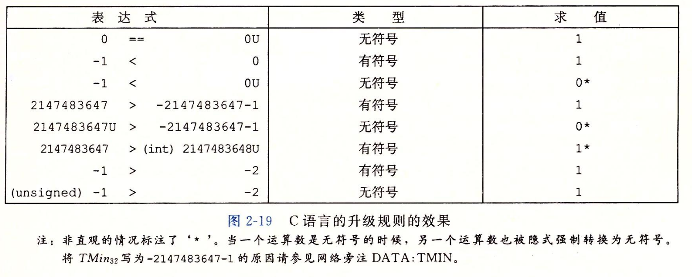

- #+BEGIN_PINNED
  Bryant, Randal E., and David R. O’Hallaron. 深入理解计算机系统. Translated by 龚奕利 and 贺莲. Third Edition. Beijing: 机械工业出版社, 2016.p52-53
  #+END_PINNED
- C中默认情况下数字都是有符号的，要创建无符号数需要显式的加上后缀`U`，如`0x1234U`
- C中虽然没有明确规定无符号数和有符号数之间如何转换，但大多数情况下，都默认保持底层不变。和之前的 [[R1A1D --- 无符号数和补码的相互转换]]一样
	- **显式转换**是强制转换
	- 当一种类型被赋值给另一种类型时，发生**隐式转换**
- **奇特行为**: 当执行一个运算时，如果其中一个是无符号数，另一个是有符号数，C会把有符号数隐式转换为无符号数，并假设这两个数是非负的，来处理这个运算。这在标准的算术运算时可能不会发生问题，但在`>`或者`<`进行比较的时候就会发生严重的错误。
	- 
	- [[RE1A1K1 --- 练习 2-21]]
	-
-