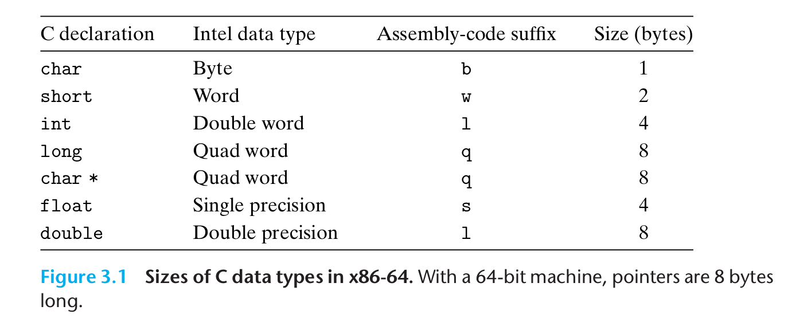

- #+BEGIN_PINNED
  Bryant, R. E., & O’Hallaron, D. R. (2016). 深入理解计算机系统 (龚奕利 & 贺莲, Trans.; Third Edition). 机械工业出版社.p119
  #+END_PINNED
- {:height 261, :width 603}
- 汇编代码后缀(Assembly-code suffix)指的是汇编指令的后缀，它表明要将操作的数据类型的大小，比如`movq`指令表明要“移动四字数据”。
-
-