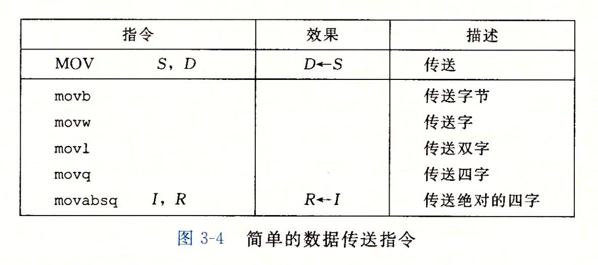
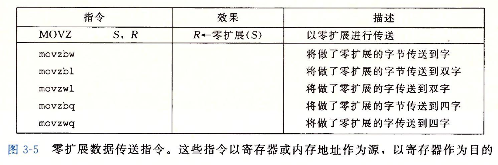
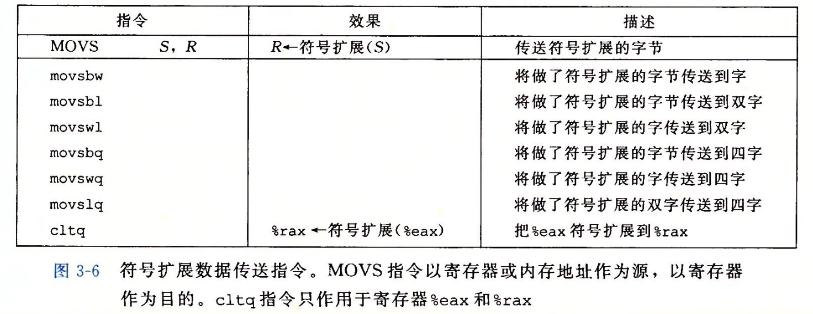

- #+BEGIN_PINNED
  Bryant, R. E., & O’Hallaron, D. R. (2016). 深入理解计算机系统 (龚奕利 & 贺莲, Trans.; Third Edition). 机械工业出版社.p122
  #+END_PINNED
- ## MOV类
	- `MOV`类是最直接的数据传送指令，它的源操作数指定的值是一个立即数，目的是一个寄存器或者内存地址。
	- ### 限制
		- 由于历史原因，源操作数和目的操作数不能都为内存地址。
		- 如果源操作数是一个寄存器，它必须和指令后缀严格匹配。
		- 常规的`movq`指令只能以扩展为64位的32位补码数作为源操作数的值，要想以64位数作为值的话需要使用`movabsq`。
	- ### 副作用
		- 当目的操作数是一个寄存器时，`movl`指令会把寄存器的高32位设为0。
	- 
- ## MOVZ类
	- 将较小的值以^^零扩展^^的形式复制到目的操作数
	- 
- ## MOVS类
	- 将较小的值以^^符号扩展^^的形式复制到目的操作数
	- 
-