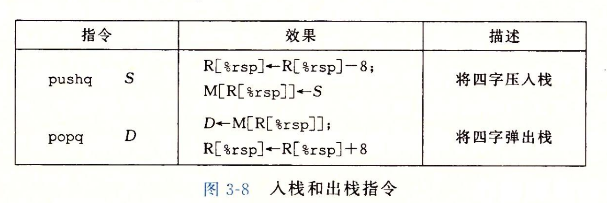

- #+BEGIN_PINNED
  Bryant, R. E., & O’Hallaron, D. R. (2016). 深入理解计算机系统 (龚奕利 & 贺莲, Trans.; Third Edition). 机械工业出版社.p127-128
  #+END_PINNED
- ## 指令
	- 栈操作相关的指令有两个:
		- `pushq S` 它将S操作数的值(四字)压入栈中。
		- `popq D` 它将栈中的数据(四字)取出放入目的操作数。
	- 
- ## 栈、`%rsp`和指令
	- 计算机中的栈是向下增长的，由`%rsp`维护栈顶位置。那么`pushq %rbp`的作用就相当于:
		- ``` asm
		  		  subq 	%rsp, 8
		  		  movq 	%rbp, (%rsp)
		  ```
		- 但它们之间的区别是，`pushq`指令只需要一个字节，上面两条指令需要8个字节。
-
-