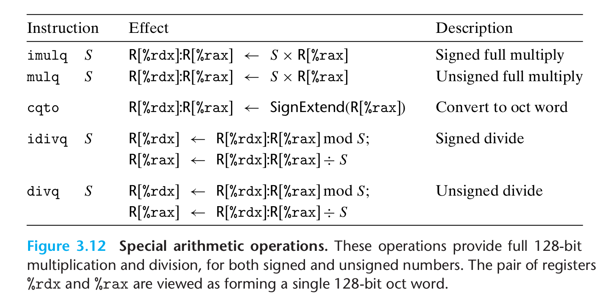

- #+BEGIN_PINNED
  Bryant, R. E., & O’Hallaron, D. R. (2016). 深入理解计算机系统 (龚奕利 & 贺莲, Trans.; Third Edition). 机械工业出版社.p133-134
  #+END_PINNED
- ## Overview
	- {:height 377, :width 740}
- ## 全乘法
	- ### imulq
		- `imulq`有两种形式:
			- 一种由两个操作数，分别代表两个64位的数字然后相乘得到一个64位的结果。
			- 另一种只有一个操作数，要求一个数存放在`%rax`中，另一个作为操作数给出，得到的结果的高64位存放在`%rdx`中，低64位存放在`%rax`中。**例子**: [[R1A4F2A --- x86-64 全乘法例子]]
- ## 除法
	- ### idivq/divq
		- 指令的操作数作为除数。
		- 被除数的高64位存放在`%rdx`中，低64位存放在`%rax`中。得到的结果的商存放在`%rax`，余数存放在`%rdx`。
	- ### cqto
		- 对于大多数除法应用来说，被除数也常常是64位。这时它`%rdx`中的高64位可能需要设为全0(无符号)或者符号扩展(补码)。这个操作可以通过`cqto`指令完成。
	- **例子**: [[R1A4F2B --- x86-64 除法例子]]
-
-