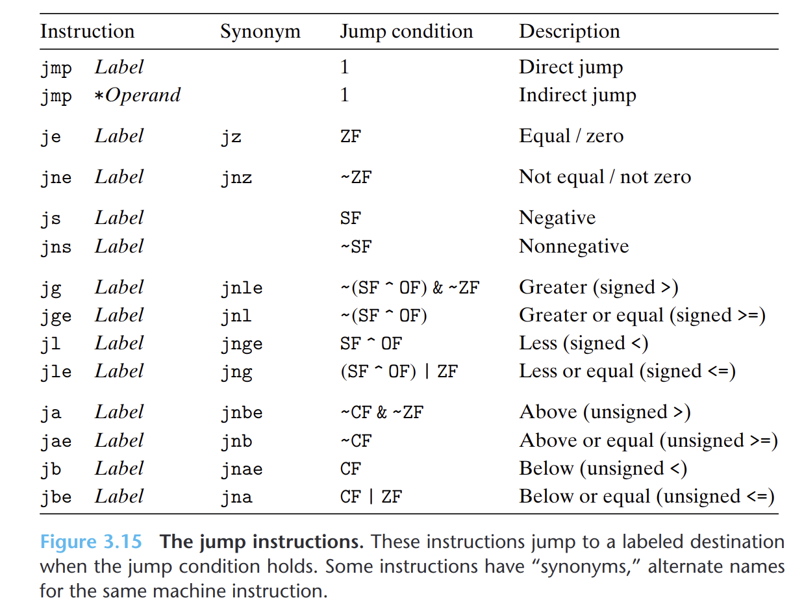

- #+BEGIN_PINNED
  Bryant, R. E., & O’Hallaron, D. R. (2016). 深入理解计算机系统 (龚奕利 & 贺莲, Trans.; Third Edition). 机械工业出版社.p138-139
  #+END_PINNED
- 跳转指令会导致执行切换到程序中一个全新的位置。在汇编代码中，跳转的目的地通常用一个标号指明。
- {:height 444, :width 585}
	- **直接跳转**
		- 跳转目标作为指令的一部分编码，在汇编代码中，跳转目标作为一个标号给出，写作`jmp *Label`
	- **间接跳转**
		- 跳转目标从寄存器或内存中读出，写作`jmp *Operand`。
-