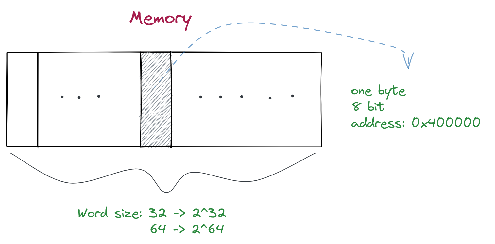

note-type:: Reference
source-type:: book
source-id:: csapp3zh

- #+BEGIN_PINNED
  Bryant, R. E., & O’Hallaron, D. R. (2016). 深入理解计算机系统 (龚奕利 & 贺莲, Trans.; Third Edition). 机械工业出版社.p27
  #+END_PINNED
- ## 字长
	- 字长表示指针数据的标称大小。 [[R20001 --- 标称大小]]
		- 指针是一个地址，字长是理论上可以表示的地址的最大值的大小。比如虚拟地址的最大值是`0xFFFFFFFF`，它所占据的空间是32位，即字长。字长是决定虚拟地址空间大小最重要的一方面。
- ## 内存
	- 在内存中，最小的信息单位是字节`byte`，有8个位。每个在内存中的字节都有一个独立的地址。
	- 内存的大小和字长强相关, 字长32位的机器有`2^32`个字节的内存，也就是4GB。
	- {:height 286, :width 556}
	-