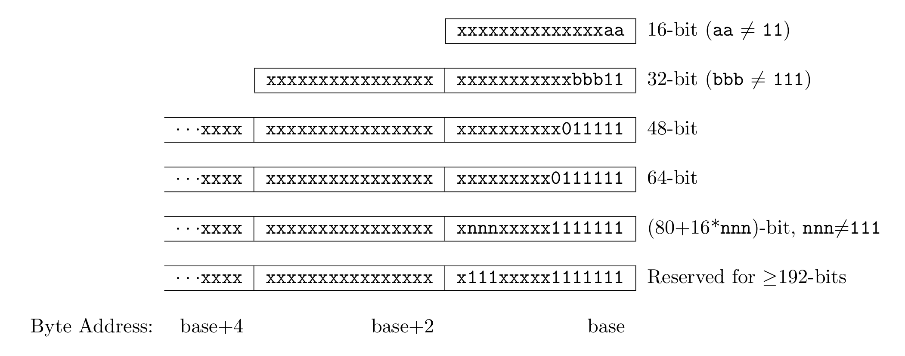

- #+BEGIN_PINNED
  Waterman, A., & Asanović, K. (2019). The RISC-V Instruction Set Manual: Vol. Unprivileged ISA (v20191213 ed.). c1.5
  #+END_PINNED
- The base RISC-V ISA has fixed-length 32-bit instructions that must be naturally aligned on 32-bit boundaries.
	- However, the standard RISC-V encoding scheme is designed to support ISA extensions with variable-length instructions, where each instruction can be any number of 16-bit instruction **parcels** in length and parcels are naturally aligned on 16-bit boundaries.
		- The standard compressed ISA extension reduces code size by providing compressed 16-bit instructions and relaxes the alignment constraints to allow all instructions to be aligned on any 16-bit boundary to improve code density.
- ## Terminology
	- **IALIGN**: Use it to refer to the instruction-address alignment constraint the implementation enforces.
		- IALIGN is 32 bits in the base ISA, but some ISA extensions, including the compressed ISA, relax IALIGN to 16 bits. IALIGN may not take on any value other than 16 or 32.
	- **ILEN**: Use it to refer to the maximum instruction length supported by an implementation, and witch is always a multiple of IALIGN.
		- All the 32-bit instructions in the base ISA have their lowest two bits set to `11`.
		- The optional compressed 16-bit instruction-set extensions have their lowest two bits equal to `00`, `01`, `10`.
- ## The standard RISC-V instruction-length encoding convention
	- 
- ## Expanded Instruction-Length Encoding
	-