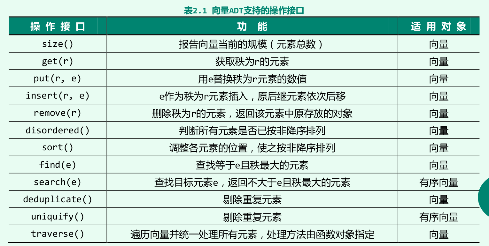

- #+BEGIN_PINNED
  邓俊辉. (2013). 数据结构: C++语言版 (3rd ed.). 清华大学出版社.p28
  #+END_PINNED
- 数据结构根据数据项之间的逻辑次序，分为==线性结构==，==半线性结构==和==非线性结构==。
	- **序列**是最基本的线性结构，根据元素和实际位置的关系又可以分为**向量**和**列表**。
		- 向量逻辑相邻的元素在物理上也相邻。
		- 列表逻辑相邻的元素在物理上不一定相邻。
- ## 数组和向量
	- 向量是数组上层的抽象。
	- 向量的秩和数组下标相似，向量是循秩访问的。
- ## 接口
	- 操作接口
		- 
	- 模板类
		- [[R3A2A --- 向量模板类]]
- ## 构造与析构
	- [[R3A2B --- 向量的构造与析构]]
-
	-
	-