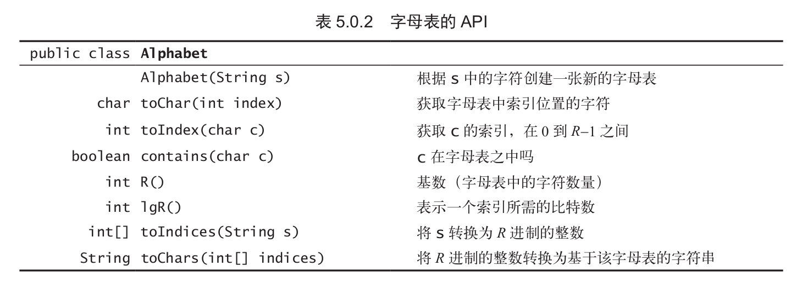

- #+BEGIN_PINNED
  Sedgewick, R., & Wayne, K. (2012). 算法 (谢路云, Trans.; 4th ed.). 人民邮电出版社.p451-454
  #+END_PINNED
- ## 字母表
	- 可以设计一个字母表来限制应用程序使用到的字符，对其中的字符进行编码
	- *api*
		- 
		- `int lgR()`计算一个字符需要的比特数。
			- 这是对所有字符进行编码，每个字符都有唯一的一个二进制数与之对应。这些二进制数中最大的那个所占的比特数就是一个索引所需的比特数。而最大的那个数可以通过`R`不断对二取模获得。
	- *实现*
		- **数据成员**: `char[] alphas`、`int[] inverse = new int[Character.MAX_VALUE]`、`int R`
			- `inverse`数组的长度被设置成最大，这是为了让左右的字符都可以被当作`inverse`的索引
	-
-