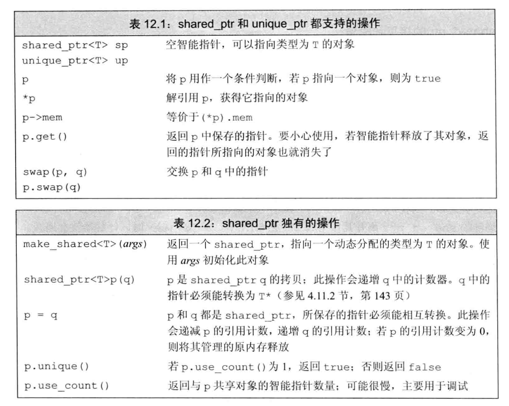

- #+BEGIN_PINNED
  Lippman, S. B., Lajoie, J., & Moo, B. E. (2013). C++ Primer 中文版 (王刚 & 杨巨峰, Trans.; 5th ed.). 电子工业出版社.p400-407
  #+END_PINNED
- 智能指针也是模板，类似于`vector`，创建时在尖括号中指明它所指向的类型。
	- ```C++
	  shared_ptr<string> strsp;
	  shared_ptr<int> intsp;
	  ```
- 使用方法和普通指针相似，解引用操作指向的对象。在条件判断中使用智能指针相当于在判定指针所指的对象是否为空。
	- ```C++
	  if (p1 && p1->empty()) {
	    *p1 = "Hello, World";
	  }
	  ```
- ## 支持的操作
	- {:height 408, :width 500}
- ## make_shared 函数
	- 创建`shared_ptr`最安全的方法是使用`make_shared`函数。要使用它，必须像模板一样提供类型。函数使用参数来初始化所指的对象，如果参数为空，则对象使用默认初始化。最后返回指向这个对象的智能指针。
		- ```C++
		  shared_ptr<string> sp = make_shared<string>("hi");
		  shared_ptr<int> ip = make_shared<int>();  	// ip所指的对象使用默认初始化，值为0
		  ```
	- 通常使用`auto`来简化书写
		- ```C++
		  auto pvi = make_shared<vector<int>>(); 		// 指向一个默认初始化的大小为空的向量
		  ```
- ## shared_ptr 的拷贝和赋值
	- 当进行拷贝和赋值时，每个`shared_ptr`都会记录由多少个其他`shared_ptr`指向该对象。
	- 指向相同对象的`shared_ptr`关联一个计数器，有可能使用**引用计数**，具体实现看标准库。
		- 每当`shared_ptr`被复制时，计数器递增。
		- 每当`shared_ptr`被删除或者赋新值时，计数器递减。
	- 当计数器为0时，释放所指的对象。
	- ```C++
	  auto r = make_shared<int>(42);
	  r = q; 	// 给r赋值，指向一个新地址
	  		// 递增q指向的对象的引用计数
	  		// 递减r原来指向的对象的引用计数	
	  		// r原来指向的对象已经没有引用，会自动释放
	  ```
- ## shared_ptr 自动销毁所管理的对象
	- `shared_ptr`使用对象的析构函数销毁对象。它自己的析构函数会更新它所指向的对象的引用计数。如果引用计数为0，`shared_ptr`的析构函数就会销毁对象，并释放它占有的内存。
	- `shared_ptr`还会自动释放**相关联**的内存。
		- 假设一个返回`shared_ptr`的`factory`函数
			- ```C++
			  shared_ptr<string> factory(T arg) {
			    ...
			    return make_shared<Foo>(arg);
			  }
			  ```
		- 返回的`shared_ptr`会在恰当的时候释放内存。
			- ```C++
			  void use_factory(T arg) {
			    shared_ptr<Foo> sp = factory(arg);
			  }				// 结束后，sp及其所指对象被释放
			  ```
			- 因为`sp`是局部变量，它会在块结束后被释放，它所指向的内存也会被释放。
		- 但如果由其他的`shared_ptr`指向这块内存，它所指的对象就不会被释放。
			- ```C++
			  auto use_factory(T arg) {
			    shared_ptr<Foo> sp = factory(arg);
			    return sp;
			  }				// 结束后，sp所指对象不会被释放
			  ```
			- `use_factory`返回的是`sp`的拷贝，引用计数没变，所以所指对象不会被释放。
	- ==由于`shared_ptr`的引用计数不为0就不会释放内存，所以`shared_ptr`的清除工作需要格外注意==
		- 一种情况是，将`shared_ptr`存入了一个`container`，重排了容器后，忘记清除`shared_ptr`。
- ## 使用了动态生存期的资源的类
	- *使用动态内存的原因* :
		- 程序不知道自己要使用多少对象。
		- 程序不知道所需对象的准确类型。
		- 程序需要在多个对象间共享数据。
	- 容器类使用动态内存是基于第一个原因，OOP使用动态内存是基于第二个原因。接下来的例子是基于第三个原因。
	-
	-