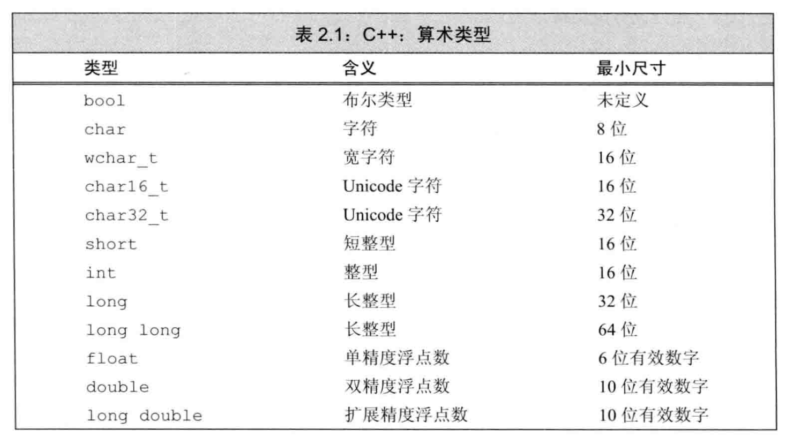
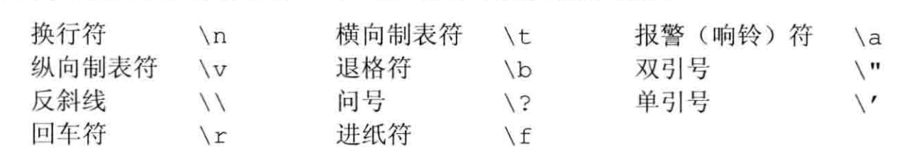
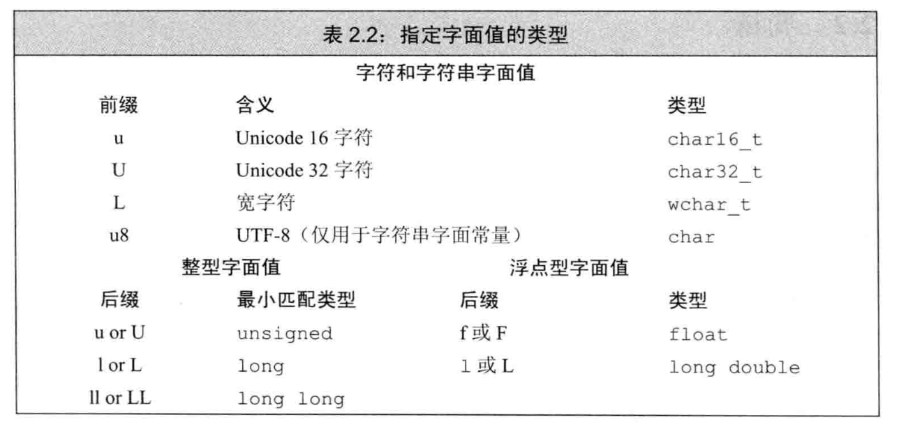

- #+BEGIN_PINNED
  Lippman, S. B., Lajoie, J., & Moo, B. E. (2013). C++ Primer 中文版 (王刚 & 杨巨峰, Trans.; 5th ed.). 电子工业出版社. c2.1
  #+END_PINNED
- C++定义了一套包括**算术类型**和**空类型**在内的基本数据类型。其中算术类型包含了字符、整型数、布尔值和浮点数。空类型不对应具体的值，仅用于一些特殊的场合。
- ## 算术类型
	- {:height 419, :width 746}
	- 浮点型可以表示单精度、双精度和扩展精度值。C++标准指定了一个浮点数的有效位数，但大多数编译器都实现了更高的精度。一般来说，类型`float`和`double`分别有7和16个有效位。
	- ### 带符号类型和无符号类型
		- `int`、`short`、`long`和`long long`都是带符号的。可以通过前面加`unsigned`得到无符号类型。
		- 字符型被分为了三种: `char`、`signed char`和`unsigned char`。但行为只有两种，`char`是有符号和无符号的其中一种，具体行为由编译器决定。
- ## 类型转换
	- #+BEGIN_NOTE
	  对象的类型定义了对象能包含的数据和能参与的运算。**转换**是其中一种被广泛支持的运算。
	  #+END_NOTE
	- 当在程序的某处我们使用了一种类型而起始对象应该取另一种类型时，程序会**自动进行**类型转换。
	- ```C++
	  bool b = 42; 	// b = true
	  int i = b;		// i = 1
	  i = 3.14;		// i = 3
	  double pi = i;	// pi = 3.0
	  unsigned char c = -1;	// 假设char占8 bit， c = 255
	  signed char c2 = 256;	// 假设char占8 bit，c2的值是未定义的
	  ```
		- 当把一个非布尔类型的算术值赋给布尔类型时，初始值为0则结果为`false`，否则结果为`true`。
		- 当把一个布尔值赋给非布尔类型时，初始值为`false`则结果为0，初始值为`true`则结果为1。
		- 当赋给无符号类型一个超出它表示范围的值时，结果是初始值对无符号类型**表示数值总数**取模后的余数。比如`unsigned char`的表示范围是0~255，有256个值。赋值-1，则结果为-1%256，得到255。
		- 当赋给带符号类型一个超出它表示范围的值时，结果是**未定义**的。
	- #+BEGIN_WARNING
	  当一个算术表达式中既有无符号数又有带符号值时，带符号值会转换成无符号数
	  #+END_WARNING
	- ```
	  1111 1111 1110 0000
	  2^3
	  ```
- ## 字面值常量
	- 一个形如`42`的值被称作字面值常量。每个字面值常量都对应一种数据类型，字面值常量的形式和值决定了它的数据类型。
	- ### 整型和浮点型字面值
		- 以`0`开头的整数代表八进制数，以`0x`或`0X`开头的为十六进制。
			- ```text
			  20 		十进制
			  020 	八进制
			  0x20 	十六进制
			  ```
		- 整型字面值具体的数据类型由它的值和符号决定:
			- 默认情况下，十进制字面值是带符号数，八进制和十六进制字面值即可能是带符号的也可能是无符号的。
			- 十进制字面值的类型是能容纳下当前值的`int `、`long`和`long long`中尺寸最小的那个。
			- 八进制和十六进制字面值的类型是能容纳当前值的`int`、`unsigned int`、`long`、`unsigned long`、`long long`和`unsigned long long`中的尺寸最小者。
			- 如果一个字面值连与之关联的最大的数据类型都放不下，将产生错误。
			- 类型`short`没有字面值。
		- 浮点型字面值表现为一个小数或以科学计数法表示的指数，其中指数部分用`E`或`e`标识
			- ```text
			  3.14
			  3.1415E0
			  0.
			  0e0
			  .001
			  ```
			- 默认的，浮点型字面值是一个`double`。
	- ### 字符和字符串字面值
		- 由单引号括起来的一个字符称为`char`型字面值，双引号括起来的零个或多个字符则构成字符串字面值。
			- `'a'`: 字符字面值。
			- `"a"`: 字符串字面值。
			- 虽然`'a'`和`"a"`都看上去都仅有一个a，但编译器会给字符串字面值加上一个结束字符`'\0'`。字符串字面值是一个以`'\0'`为结尾的字符数组。
	- ### 转义序列(escape sequence)
		- 
		- 可以使用泛化的转义序列，其形式是`\x`后紧跟一个或多个十六进制数字，或者`\`后紧跟1个、2个或3个八进制数字，其中数字部分表示的是字符对应的数值。
		- #+BEGIN_WARNING
		  如果反斜线`\`后面跟着的八进制数字超过3个，只有前3个数字与`\`构成转义序列。相反，`\x`要用到后面跟着的所有数字，如果该字符超出`char`型所能表示的范围，需要添加前缀以匹配更大的字符类型。
		  #+END_WARNING
	- ### 指定字面值的类型
		- 
	- ### 布尔字面值和指针字面值
		- `true`和`false`是布尔类型的字面值
		- `nullptr`是指针字面值
-