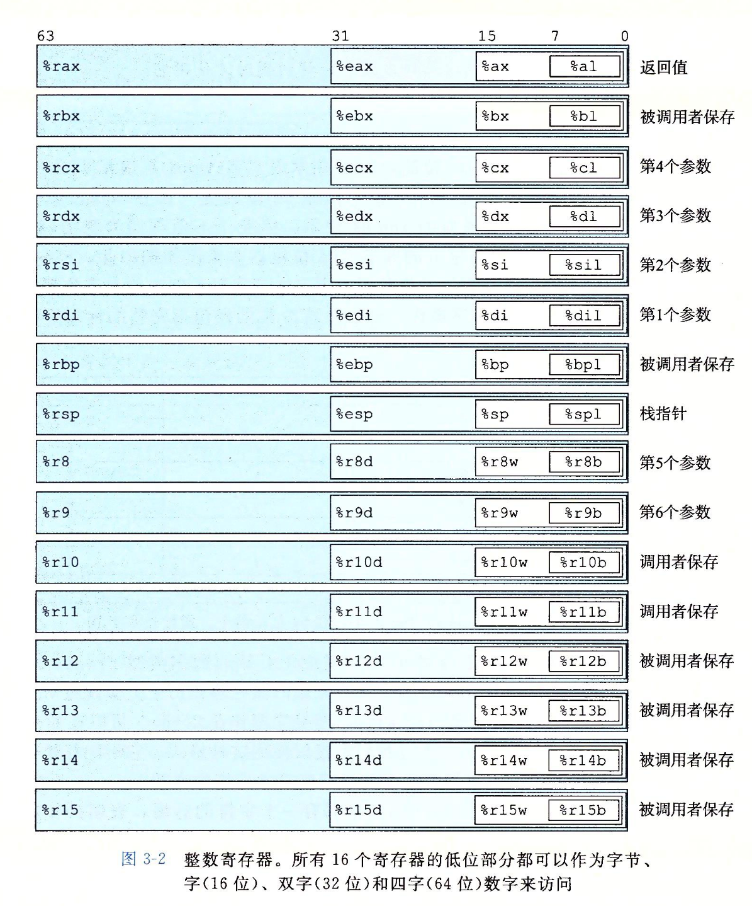

note-type:: Reference
source-type:: book
source-id:: csapp3zh

- #+BEGIN_PINNED
  Bryant, R. E., & O’Hallaron, D. R. (2016). 深入理解计算机系统 (龚奕利 & 贺莲, Trans.; Third Edition). 机械工业出版社.p119-120
  #+END_PINNED
- 一个x86-64的CPU包含16个64位的通用目的寄存器。
	- {:height 906, :width 746}
	- 最初，在8086中只有8个16位寄存器(%ax-%bp)，后来在IA32扩展到32位,使用新的名称(%eax-%ebp)，现在从IA32扩展到64位，变为(%rax-%rbp)，又新增了8个寄存器(%r8-%r15)，使用新的命名规则。
	-