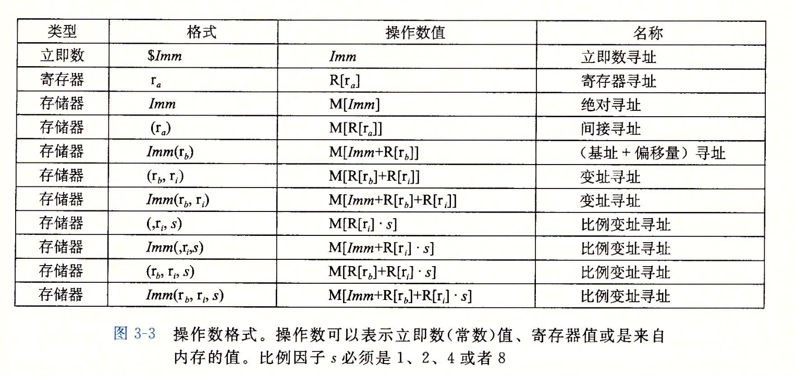

note-type:: Reference
source-type:: book
source-id:: csapp3zh

- #+BEGIN_PINNED
  Bryant, R. E., & O’Hallaron, D. R. (2016). 深入理解计算机系统 (龚奕利 & 贺莲, Trans.; Third Edition). 机械工业出版社.p121
  #+END_PINNED
- x86-64支持多种操作数形式:
	- *立即数*
		- `$Imm`，使用符号`$`指示操作数是立即数，操作数的值是`Imm`
	- *寄存器*
		- $r_a$ ，表示操作的是寄存器里的值，操作数值是 $R[r_a]$ 。你可以将寄存器们看作是一个数组，获取操作数值时寄存器的名字作为index。
	- *内存引用*
		- 内存引用操作数的值是计算出来的地址中的内容。
		- 内存引用有多种形式，但都是 $Imm(r_a, r_b, s)$ 的变体。两个寄存器都必须是64位寄存器，它的计算结果是 $Imm + R[r_a] + R[r_b] \times s$ ，其中 $s$ 的值只能是`1 2 4 8`。
	- 
-