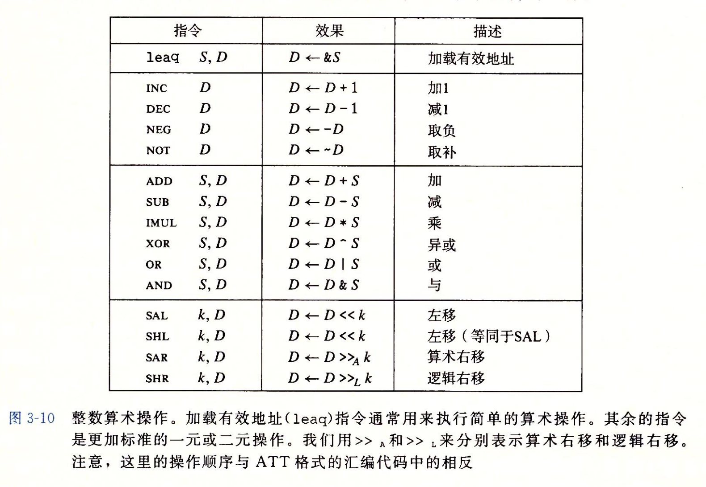

note-type:: Reference
source-type:: book
source-id:: csapp3zh

- #+BEGIN_PINNED
  Bryant, R. E., & O’Hallaron, D. R. (2016). 深入理解计算机系统 (龚奕利 & 贺莲, Trans.; Third Edition). 机械工业出版社.p128-131
  #+END_PINNED
- 
- 图中除了`leaq`之外，都有四个变种，分别对字节，字，双字和四字进行操作。
- ## 加载内存地址
	- [[R4F1 --- x86-64 加载有效地址]]
- ## 一元操作
	- 图中第二组是一元操作，操作数既是源也是目的，可以是寄存器也可以是内存地址。‘
- ## 二元操作
	- 图中第三组是二元操作，第二个操作数既是源也是目的。第一个操作数可以是立即数，寄存器或者内存引用。第二个操作数可以是寄存器或者内存引用。
- ## 移位
	- 第一个操作数代表移位量，可以是立即数，或者存放在单字寄存器`%cl`中。
		- x86-64中，对 $w$ 位的数据，移位量由`%cl`的低 $m$ 位决定，其中 $2^m = w$
	- 第二个寄存器可以是寄存器或者内存引用。
- ## 特殊的算数操作
	- [[R4F2 --- x86-64 整数全乘法和除法]]
	-