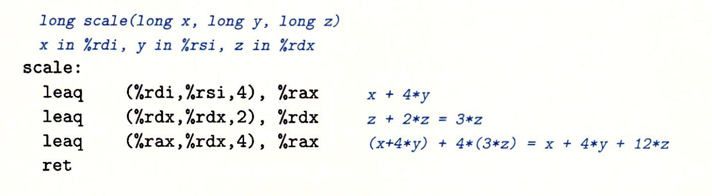

note-type:: Reference
source-type:: book
source-id:: csapp3zh

- #+BEGIN_PINNED
  Bryant, R. E., & O’Hallaron, D. R. (2016). 深入理解计算机系统 (龚奕利 & 贺莲, Trans.; Third Edition). 机械工业出版社.p129
  #+END_PINNED
- ## leaq
	- `leaq`指令它的名字叫做“加载有效地址”，但实际上也可以用来进行算数操作，这是因为它的“有效地址”是计算出来的。
		- `leaq S D`指令实际上是`movq`的变形，`S`操作数是内存引用，`D`操作数是寄存器。`leaq`是存入的是内存引用的地址。因为内存引用的地址有它特殊的计算方式，这就让`leaq`指令可以作为算数操作来使用。
- ## 例子
	- ``` C
	  	  long scale(long x, long y, long z) {
	  	    long  r = x + 4 * y + 12 * z;
	  	    return r;
	  	  }
	  ```
	- 
-