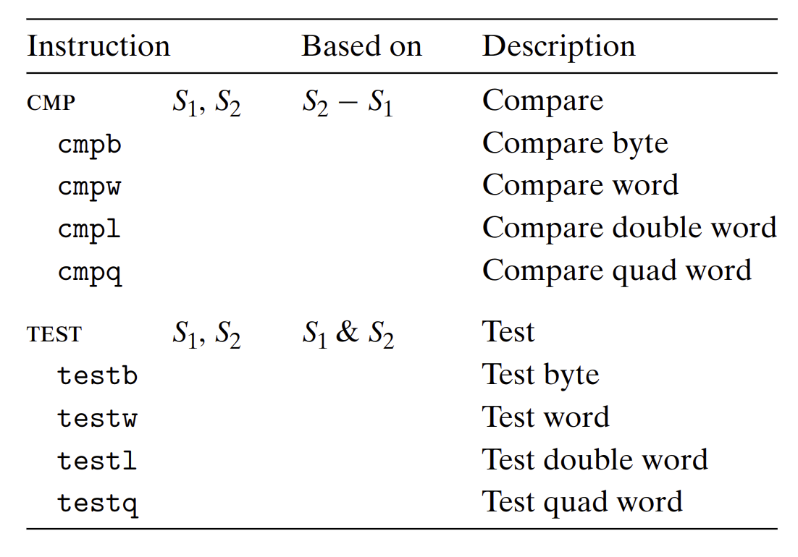

note-type:: Reference
source-type:: book
source-id:: csapp3zh

- #+BEGIN_PINNED
  Bryant, R. E., & O’Hallaron, D. R. (2016). 深入理解计算机系统 (龚奕利 & 贺莲, Trans.; Third Edition). 机械工业出版社.p134-135
  #+END_PINNED
- 除了整数寄存器，CPU还维护着一组单个位的**条件码寄存器**，保存最近执行的算数或逻辑指令的状态信息。
	- **CF**：进位标志。最近的操作最高位产生了进位。可用来检测无符号的溢出。
	- **ZF**：零标志。最近的操作结果为0。
	- **SF**：符号标志。最近的操作得到的结果为负数。
	- **OF**：溢出标志。最近的操作导致一个补码溢出——正溢出或负溢出。
- #+BEGIN_NOTE
  `leaq` 指令不会改变任何条件码。因为它本意是用来进行地址计算的。
  #+END_NOTE
- `CMP`指令和`TEST`指令只设置条件码而不改变任何其他寄存器。
	- `CMP`根据两数之差来设置条件码。除了只设置条件码而不更新目的寄存器，`CMP`指令和`SUB`指令的行为是一样的。
	- `TEST`指令和`AND`指令行为一样，除了不改变目的寄存器。典型应用是检测负数(操作数是相同的，负数会进位)。或者让其中一个数是掩码来检测另一个数的置位情况。
	- {:height 399, :width 591}
-