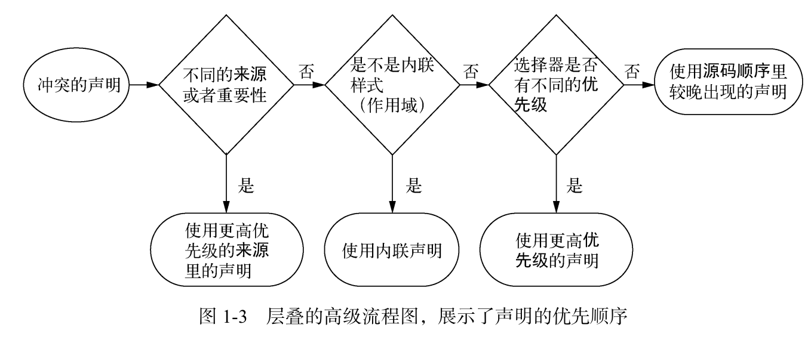

- #+BEGIN_PINNED
  Grant, K. J. (2020). 深入解析CSS (黄小璐 & 高楠, Trans.; 1st ed.). 人民邮电出版社. c1.1
  #+END_PINNED
- 层叠是一系列的规则，它指示了浏览器该如何解决样式冲突。所谓冲突是指，多个样式应用到了同一个对象。层叠的规则决定了此时哪一个样式真正生效。
- 层叠依据三个条件来解决冲突。==样式表的来源==、==选择器的优先级==、==源码顺序==。
- {:height 278, :width 649}
- ## 样式表的来源
	- 浏览器有一个默认的样式，即==用户代理样式表==。你的样式可以覆盖掉它，即==作者样式表==的优先级高于默认样式。
	- ### `!important`声明
		- 标记为`!important`的声明会获得更高的优先级。
		- 总体的优先级从高到低排列为:
			- a) 作者的`!important`
			- b) 作者
			- c) 用户代理
- ## 优先级
	-