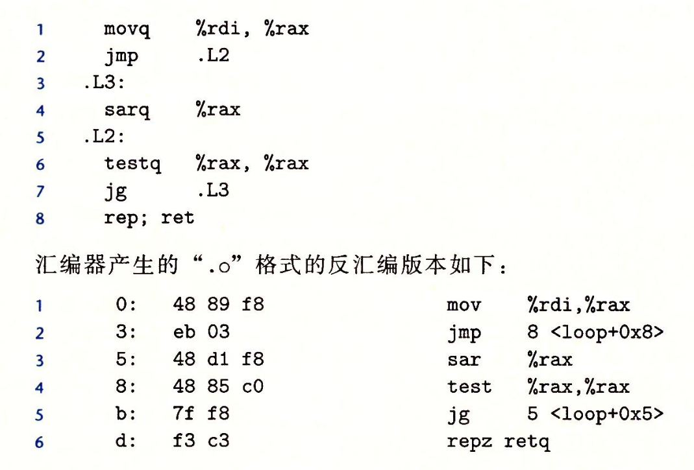
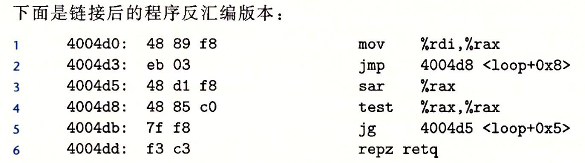

note-type:: Reference
source-type:: book
source-id:: csapp3zh

- #+BEGIN_PINNED
  Bryant, R. E., & O’Hallaron, D. R. (2016). 深入理解计算机系统 (龚奕利 & 贺莲, Trans.; Third Edition). 机械工业出版社.p139-141
  #+END_PINNED
- 跳转指令的编码有多种方式，一种方式是直接给出“绝对地址”，将地址编码为4个字节。最常用的方式是PC相对寻址。
- ## PC相对寻址
	- 总的来说，就是将跳转目标编码为一个偏移量，真正的目标地址是这个偏移量加上下一条指令的地址。偏移量可以编码为1、2或4个字节。
	- ### 例1:
		- {:height 170, :width 460}
		- 上图中`jmp 8 <loop+0x8>`的偏移量编码为`03`，下一条指令的位置在`05`，它们相加得到真正要跳转的位置`0x8`
		- 上图中`jg 5 <loop+0x5>`的偏移量编码为`f8`，下一条指令的位置在`0d`，它们相加得到真正要跳转的地址`0x5`
	- **例2**
		- 
		-
		-
	-
-