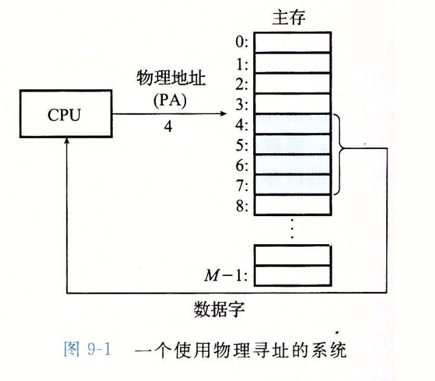
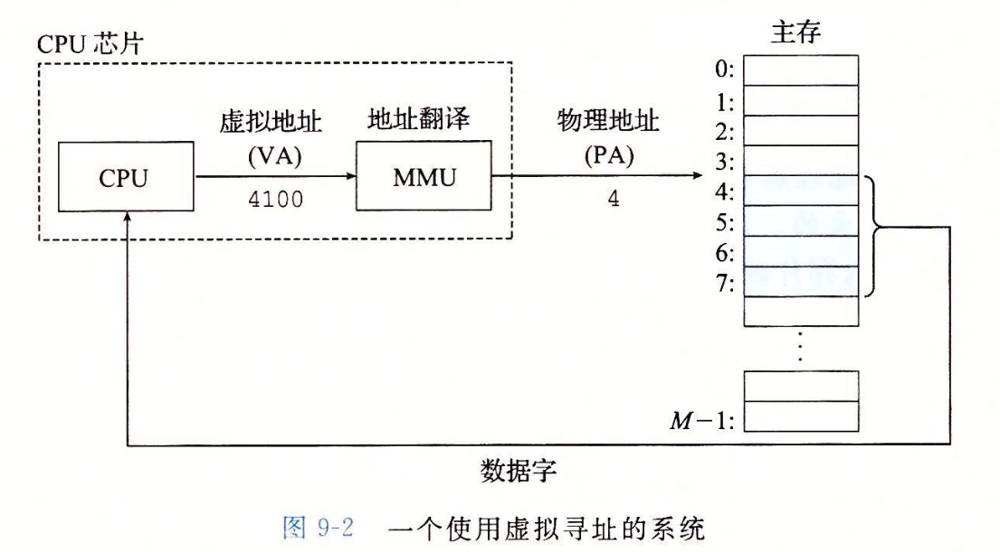

note-type:: Reference
source-type:: book
source-id:: csapp3zh

- #+BEGIN_PINNED
  Bryant, R. E., & O’Hallaron, D. R. (2016). 深入理解计算机系统 (龚奕利 & 贺莲, Trans.; Third Edition). 机械工业出版社.p560
  #+END_PINNED
- ## 物理寻址
	- CPU直接根据内存上的地址访问内容。
	- {:height 248, :width 279}
	-
- ## 虚拟寻址
	- CPU生成一个虚拟地址(Virtual Address)，经过内存管理单元(Memory Management Unit , MMU)翻译成物理地址，然后访问其中的内容。
	- *地址翻译*(address translation)需要CPU和操作系统之间紧密合作，MMU利用存放在内存中的查询表来动态的翻译地址。
	- 
	-