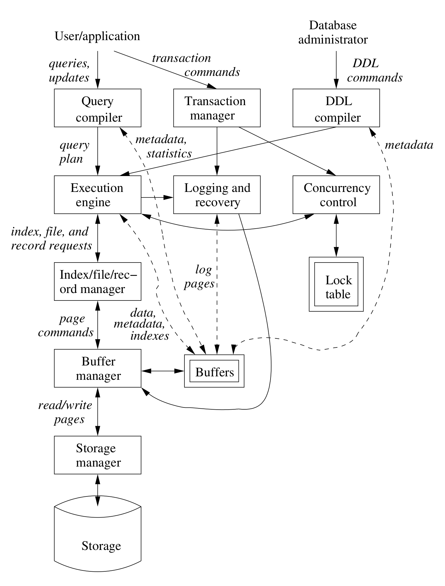

- #+BEGIN_PINNED
  Garcia-Molina, H., Ullman, J. D., & Widom, J. (2014). Database systems: the complete book (2nd ed.). Pearson. c1.2
  #+END_PINNED
- ## Database management system components
	- {:height 653, :width 492}
		- **Single boxes** represent system components
		- **Double boxes** represent in-memory data structures
		- The **solid lines** indicate control and data flow
		- The **dashed lines** indicate data flow only
	- At the top, there are two distinct source of commands to the DBMS:
		- Conventional users and applications that ask for data or modify data.
		- A ==*database administrator*==: a person or persons responsible for the structure or schema of the database.
- ## Data-definition Language Commands
	- The DDL commands have the ability to create and modify a schema's structure. They can also alter the schema's constraint information.
	- These commands are parsed by a DDL processor and passed to the execution engine, which then goes through the index/file/record manager to alter the metadata, that is, the schema information for the database.
- ## Overview of Query Processing
	- A user or an application program use DML command to perform some action. This command does not affect the schema of the database, but may affect the content of the database or will extract data from the database.
	- DML statements are handled by two separate subsystems, as follows:
		- ### Answering the Query
			- The query is passed to ==*query compiler*==, then get ==*query plan*==.
			- The *query plan* or a sequence of actions that the DBMS will perform to answer the query, is passed to the ==*execution engine*==.
			- The execution engine issues a sequence of requests for small piece of data, typically records or tuples of a relation, to a resource manager that knows about ==*data files*==, the format and size of records in those files, and ==*index files*==, which help find elements of data files quickly.
			- The request for data are passed to the ==*buffer manager*==.
				- The buffer manager's task is to bring appropriate portions of the data from secondary storage(disk) to  the main memory buffers. Normally, the page or "disk block" is the unit of transfer between buffers and disk.
			- The buffer manager communicates with a storage manager to get data from disk.
				- The storage manager might involve operating-system commands, but more typically, the DBMS issues commands directly to the disk controller.
		- ### Transaction Processing
			- Queries and other DML actions are grouped into ==*transactions*==, which are units that must be executed atomically and in isolation from one another.
			- Any query or modification can be transaction itself.
			- The execution of a transaction must be ==*durable*==, meaning that the effect of any completed transaction must be preserved even if the system fails in some way right after completion.
			- Divide the transaction processor into two parts:
				- A ==*concurrency-control manager*==, or ==*scheduler*==, responsible for assuring atomicity and isolation of transactions.
				- A ==*logging and recovery manager*==, responsible for the durability of transactions.
- ## Storage and Buffer management
	- ### storage manger
		- The ==*storage manager*== controls the placement of data on disk and its movement between disk and main memory.
			- The data of a database normally resides in secondary storage. To perform any useful operation on data, that data must be in main memory.
		- For efficiency purposes, DBMS's normally control storage on the disk directly. The storage manager keeps track of the location of files on the disk and obtain the block or block containing a file on request from the buffer manager.
	- ### buffer manager
		- The ==*buffer manager*== is responsible for partitioning the available main memory into ==*buffers*==, which are page-sized regions into which disk blocks can be transferred.
		- Thus, all DBMS components that need information from the disk will interact with the buffers and the buffer manager, either directly or through the execution engine. The kinds of information that various components may need include:
			- *Data*: the contents of the database itself.
			- *Metadata*: the database schema that describes the structure of, and constrains on, the database.
			- *Log Records*: information about recent changes to the database; these support durability of the database.
			- *Statistics*: information gathered and stored by the DBMS about data properties such as the size of, and values in, various relations or other components of the database.
			- *Indexes:* data structures that support efficient access to the data.
- ## Transaction Processing
	- The *transaction manager* accepts *transaction commands* from an application, which tell the transaction manager when transaction begin and ends, as well as information about the expectations of the application (some may not with to require atomicity).
	- The transaction processor performs the following tasks:
	  background-color:: red
		- ### _Logging_
			- In order to assure durability, every change in database is logged separately on disk.
			- The ==*log manager*== follows one of several policies designed to assure that no matter when a system failure or "crash" occurs, a ==*recovery manager*== will be able to examine the log of changes and restore the database to some consistent state.
			- The log manager initially writes the log in buffers and negotiates with the buffer manager to make sure that buffers are written to disk at appropriate times.
		- ### _Concurrency control_
			- Transaction must appear to execute in isolation. But in most systems, there will in truth be many transactions executing at once.
			- The scheduler (concurrency-control manager) must assure that the individual actions of multiple transactions are executed in such an order that the net effect is the same as if the transactions had in fact executed in their entirety, one-at-a-time.
			- A typical scheduler does its work by maintaining ==*locks*== on certain pieces of the database. These locks prevent two transactions from accessing the same piece of data in ways that interact badly.
				- Locks are generally stored in a main-memory ==*lock table*==.
			- The scheduler affects the execution of queries and other database operations by forbidding the execution engine from accessing locked parts of the database.
		- ### _Deadlock resolution_
			- As transaction compete for resources through the locks that the scheduler grants, they can get into a situation where none can proceed because each needs something another transaction has.
			- The transaction manager has the responsibility to intervene and cancel one or more transactions to let others proceed.
- ## The Query Processor
	- The query processor is represented by two compnents:
		- ### _The Query Compiler_
			- It translate query into an internal form called *query plan*. Often the operations in a query plan are implementations of "relational algebra" operations.
			- The query compiler consists of three major units:
				- A ==*query parser*==, which builds a tree structure from the textual form of the query.
				- A ==*query preprocessor*==, which performs semantic checks on the query and performing some tree transformations to turn the parse tree into a tree of algebraic operators representing the initial query plan.
				- A ==*query optimizer*==, which transforms the initial query plan into the best available sequence of operations on the actual data.
			- The query compiler uses metadata and statistics about the data to decide which sequence of operations is likely to be the fastest.
		- ### _The Execution Engine_
			- The execution engine, which has the responsibility for executing each of the steps in the chosen query plan.
			- It interacts with most of the other components of the DBMS, either directly or through the buffers.