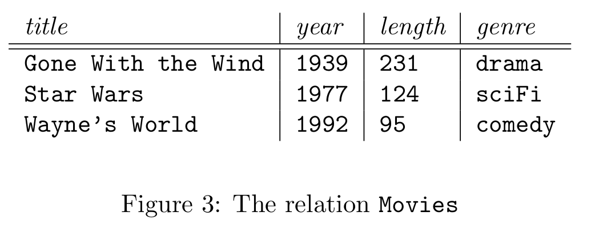

- #+BEGIN_PINNED
  Garcia-Molina, H., Ullman, J. D., & Widom, J. (2014). Database systems: the complete book (2nd ed.). Pearson. c2.2
  #+END_PINNED
- Keywords: ==Relation==
-
- The relational model gives a single way to represent data: as a two-dimensional table called **_relation_**
	- {:height 206, :width 552}
- **Attributes**: The columns of a relation.
- **Schemas**: The name of a relation and the set of attributes for a relation. As follows:
	- $$\text{Movies}(\text{title}, \text{year}, \text{length}, \text{genre})$$
- **Tuples**: The rows of a relation, other than the header row are called tuples. A tuple has one component for each attribute of a relation.
- **Domains**: Each attribute of a relation is a *domain*, that is, a particular elementary type. A tuple's componet of that attribute must belongs to the domain.
	- $$\text{Movies}(\text{title: string}, \text{year: integer}, \text{length: integer}, \text{genre: string})$$
- **Relation Instances**: A set of tuples for a given relation is an *instance* of that relation.
- **Key constraints**: A set of attributes forms a *key* for a relation if we do not allow two tuples in a relation instance to have the same values in all the attributes of the key.
-
-