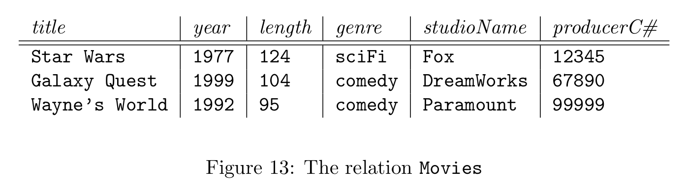
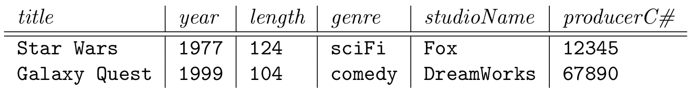
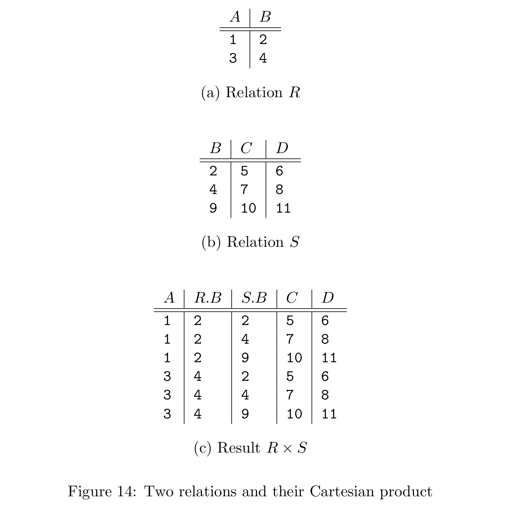
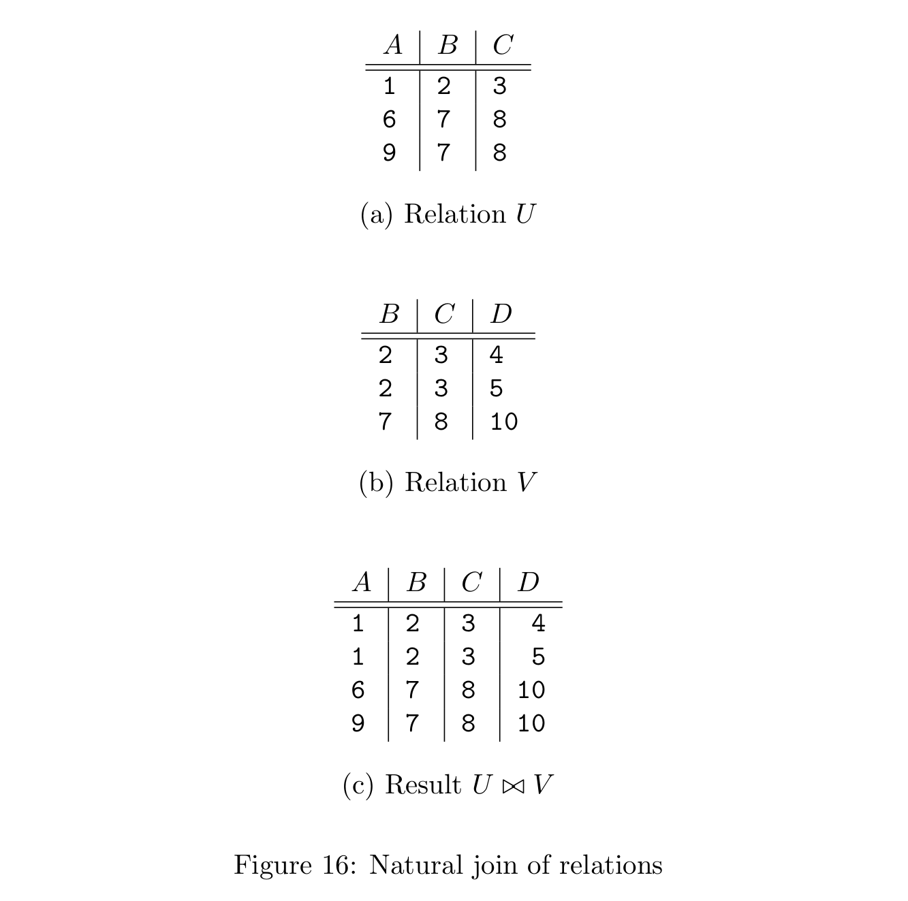
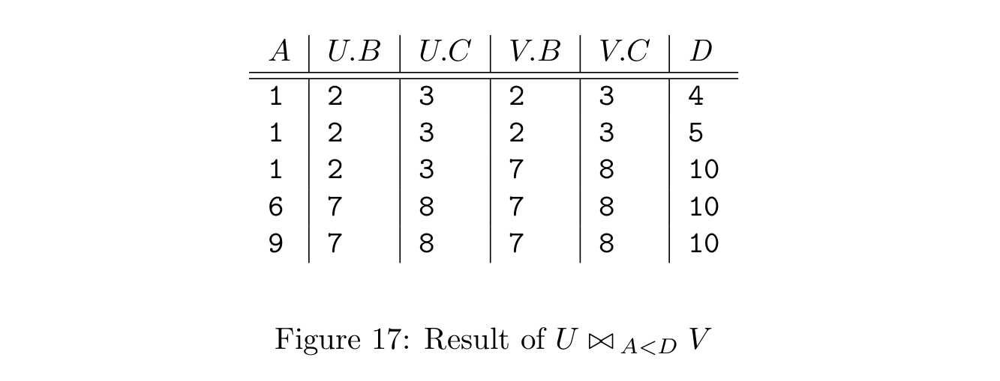

- #+BEGIN_PINNED
  Garcia-Molina, H., Ullman, J. D., & Widom, J. (2014). Database systems: the complete book (2nd ed.). Pearson. c2.4
  #+END_PINNED
- Keywords: ==Relational algebra== ==Set operations on relations== ==Projection== ==Selection==
-
- *Relational algebra* contains some simple but powerful ways to construct new relations from given relations.
	- When a DBMS processes queries, the first thing that happens to a SQL query is that it gets translated into relational algebra or a very similar internal representation.
- ## Why do we need a special query language?
	- Some programming languages suffice to ask and answer any computable question about relations. But by limiting what we can say or do in our query language, we get two huge rewards:
		- 1. Ease of programming
		- 2. The ability of the compiler to produce highly optimized code.
- ## What is an Algebra?
	- An algebra, conssits of operators and atomic operands.
		- The atomic operands are variables like $x$ and constants like 15
		- The operators are the usual arithmetic ones: addtion, subtraction, multiplication, and division.
	- Relational algebra is another example of an algebra. Its atomic operands are:
		- Variables that stand for relations.
		- Constants, which are finite relations.
- ## Overview of Relational Algebra
	- Four broad classes of the operation of the traditional relational algebra:
		- a) The usal set operations -- union, intersection, and difference -- applied to relations.
		- b) Operations that remove parts of a relation: "selection" eliminates some rows(tuples), and "projection" eleminates some columns.
		- c) Operations that combine the tuples of two relations, including "Cartesian product," which pairs the tuples of two relations in all possible ways, and various kinds of "join" operations, which selectively pair tuples from two relations.
		- d) An operation called "renaming" that does not affect the tuples of a relation, but changes the relation schema, i.e., the names of the attributes and/or the name of the relation itself.
	- We generally shall refer to expressions of relational algebra as *queries*
- ## Set Operations on Relations
	- When we apply set operations to relations, we need to put some conditions on $R$ and $S$:
		- $R$ and $S$ must have schemas with identical sets of attributes, and the types(domains) for each attribute must be the same in $R$ and $S$.
		- The columns of $R$ and $S$ must be ordered so that the order of attributes is the same for both relations.
	- If relations have same set of attributes, with corresponding domains, but use defferent names for their attributes. We may use renaming operator to change the name of their attributes.
- ## Projection
	- The *projection* operator is used to produce from a relation $R$ a new relation that has only some of $R$'s columns.
		- The value of expression $\pi_{A_1, A_2, \ldots, A_n}(R)$ is a relation that has only the columns for attributes $A_1, A_2, \ldots, A_n$ of $R$.
	- Note that in the relational algebra of sets, duplicated tuples are always eliminated.
		- E.g.
			- 
			- $\pi_{\text{genre}}(\text{Movies})$
			- 
- ## Selection
	- The *selection* operator, applied to a relation $R$, produces a new relation with a subset of $R$'s tuples. The tuples in the resulting relation are those that satisfy some condition $C$ that involves the attibutes of $R$. We denote the operation $\sigma_C(R)$.
	- E.g.
		- $\sigma_{length \geq 100}(\text{Movies})$
		- 
- ## Cartesian Product
	- The *Cartesian product* of two sets $R$ and $S$ is the set of paires that can be formed by choosing the first element of the pair to be any element of $R$ and the second any element of $S$. When $R$ and $S$ are relations, the product is essentially the same.
		- E.g.
			- 
- ## Natural Joins
	- *Natural join*, denoted by $R \Join S$, in which we pair only those tuples from $R$ and $S$ that agree in whatever attibutes are common to the schemas of $R$ and $S$.
		- Let $A_1, A_2, \ldots, A_n$ be all the attributes that are in both the schema of $R$ and the schema of $S$. Then a tuple $r$ from $R$ and a tuple $s$ from $S$ are successfully paired if and only if $r$ and $s$ agree on each of the attributes $A_1, A_2, \ldots, A_n$.
		- If the tuples $r$ and $s$ are successfully paired in the join $R \Join S$, then the result of the pairing is a tuple, called the *joined tuple*, with one component for each of the attributes in the union of the schemas of $R$ and $S$.
	- E.g.
		- 
- ## Theta-Joins
	- The notation for a theta-join of relations $R$ and $S$ based on condition $C$ is $R\Join_C S$. The result of this operation is constructed as follows:
		- a) Take the product of $R$ and $S$
		- b) Select from the product only those tuples that satisfy the condition $C$.
	- E.g.
		- 
- ## Combining Operations to Form Queries
	- Relational algebra allows us to form expressions of arbitrary complexity by applying operations to the result of other operations.
	- E.g.
		- 
		- What are the titles and years of movies made by Fox that are at least 100 minutes long?
			- $\pi_{title, year}(\sigma_{length \geq 100 \text{ AND } studioName=\text{'Fox'}}(\text{Movies}))$
- ## Naming and Renaming
	- We use $\rho_{S(A_1, A_2, \ldots, A_n)}(R)$ to rename a relation $R$. The resulting relation has exactly the same tuples as $R$, but the name of the relation is $S$. Moreover, the attributes of the result relation $S$ are named $A_1, A_2, \ldots, A_n$, in order from the left.
- ## Relationships Among Operations
	- Intersection can be expressed in terms of set difference:
		- $$R \cap S = R - (R - S) $$
	- Theta-join can be expressed by product and selection:
		- $$R \Join_C S = \sigma_C(R \times S)$$
	- The natural join of $R$ and $S$ can be expressed by starting with the product $R \times S$. We then apply the selection operator with a condition $C$ of the form
		- $$R.A_1 = S.A_1 \text{ AND } R.A_2 = S.A_2 \text{ AND } \cdots \text{ AND } R.A_n = S.A_n$$
		- Let $L$ be the list of attributes in the schema of $R$ followed by those attributes in the schema of $S$ that are not alse in the schema of $R$. Then
		- $$R \Join S = \pi_L(\sigma_C(R \times S))$$
		-
-