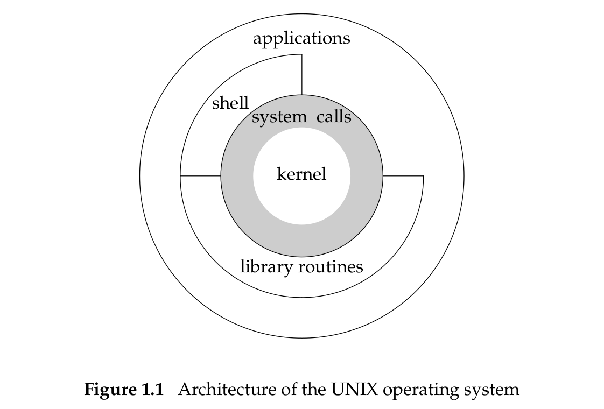

- #+BEGIN_PINNED
  Stevens, W. R., & Rago, S. A. (2013). Advanced programming in the UNIX environment (3rd ed.).Addison-Wesley. c1
  #+END_PINNED
- ## UNIX Architecture
	- {:height 286, :width 412}
	- *Kernel*: A software controls the hardware resources of the computer and provides an environment which programs can run.
	- *System calls*: A layer of software that is the interface to the kernel.
- ## Logging In
	- **_Login Name_**
		- Usually login information are stored at `/etc/passwd`.
		- `cat` the `passwd` file and then you'll get the info of different users. Each user infomation is composed of seven colon-separated fields: ==the login name==, ==encrypted password==, ==numeric user ID==(205), ==numeric group ID==(105), ==a comment field==, ==home directory==(/home/sar), and ==shell program==(/bin/ksh)
			- `sar:x:205:105:Stephen Rago:/home/sar:/bin/ksh`
	- **_Shells_**
		- A *shell* is a command-line interpreter that reads user input and executes commands. The system knows which shell to execute based on the final entry of the `passwd` file.
- ## Files and Directories
	- **_File System_**
		- The UNIX file system is a hierarchical arrangement of directories and files.
			- *root*: The directory that everything starts, denoted by `/`.
			- *directory*: A file that contains directory entries.
				- Logically, we can think of each directory entry as contaning a filename along with a structure of information describing the attributes of the file.
	- **_Filename_**
		- The names in a directory are called *filenames*. The only two characters that cannot appear in a filename are `/` and `\0`.
		- Two filenames are automatically created whenever a new directory is created `.` and `..`, which refers to the current directory and parent directory.
	- **_Pathname_**
		- A sequence of one or more filenames, separated by slashes and optionally starting with a slash, forms a `pathname`.
			- A pathname that begins with a slash is called an *absolute pathname*; otherwise, it's called a *relative pathname*.
	- **_Working Directory_**
		- Every process has a *working directory*. A process can change its working directory with the `chdir` function.
- ## Input and Output
	- **_File Descriptors_**
		- File descriptors are normally small non-negative integers that the kernel uses to identify the files accessed by a process.
	- **_Standard Input, Standard Output, and Standard Error_**
		- By convention, all shells open these three descriptors whenever a new program is run. Most shells provide a way to redirect any or all of these three descriptors to any file.
	- **_Unbuffered I/O_**
		- Unbuffered I/O is provided by the function `open`, `read`, `write`, `lseek`, and `close`. These functions all work with file descriptors.
	- **_Standard I/O_**
		- The standard I/O functions provide a buffered interface to the unbuffered I/O functions.
- ## Programs and Processes
	- **_Program_**
		- A *program* is an executable file residing on disk in a directory.
	- **_Processes and Process ID_**
		- An executing instance of a program is called a *process*.
		- The UNIX System guarantees that every process has a unique numeric identifier called the *process* ID.
	- **_Process Control_**
		- There are three primary functions for process control: `fork`,`exec`, and `waitpid`.
	- **_Threads and Thread IDs_**
		- Usually, a process has only one thread of control -- one set of machine instructions executing at a time.
		- All thread within a process share the same address space, file descriptors, stacks, and process-related attributes.
		- Each thread executes on its own stack, although any thread can access the stacks of other threads in the same process.
		- Threads are identified by IDs. Thread IDs are local to a process.
- ## Error Handling
	- When an error occurs in one of the UNIX System functions, a negative value is often returned, and the integer `errno` is usually set to a value that tells why.
	- The file `<errno.h>` defines the symbol `errno` and constants for each value that `errno` can assume.