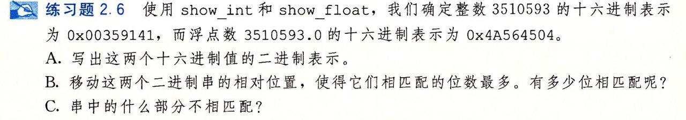

- #+BEGIN_PINNED
  Bryant, Randal E., and David R. O’Hallaron. 深入理解计算机系统. Translated by 龚奕利 and 贺莲. Third Edition. Beijing: 机械工业出版社, 2016.p34
  #+END_PINNED
- 
- ```text
  3510593: 	  00000000001 101011001000101000001
  3510583.0:		010010100 101011001000101000001 00
  ```
- 有21位匹配。根据浮点数编码，这是个规格化的值，所以`frac`字段表示的是小数点后的数，编码为`1.frac`，即1没有在字段里显示但编码时要加上。所以整数二进制里的最高位的1没有在浮点数的二进制串里匹配到。
-