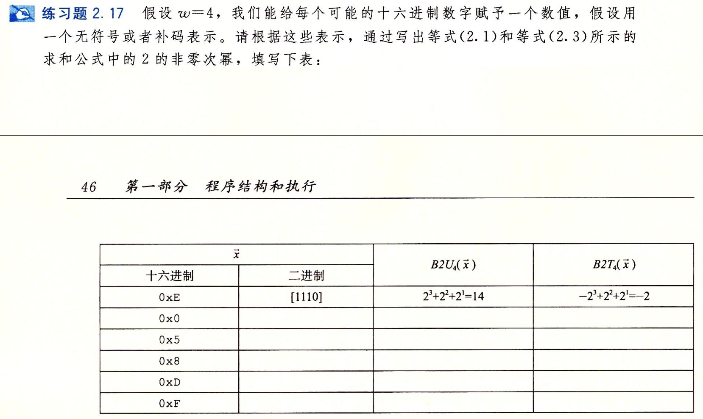

- #+BEGIN_PINNED
  Bryant, Randal E., and David R. O’Hallaron. 深入理解计算机系统. Translated by 龚奕利 and 贺莲. Third Edition. Beijing: 机械工业出版社, 2016.p45-46
  #+END_PINNED
- {:height 471, :width 776}
- ```text
  0x0		[0000]		0					0
  0x5		[0101]		2^2+2^0=5			2^2+2^0=5
  0x8		[1000]		2^3=8				-2^3=-8
  0xD		[1101]		2^3+2^2+2^0=13		-2^3+2^2+2^0=-3
  0xF		[1111]		2^3+2^2+2^1+2^0=15	-2^3+2^2+2^1+2^0=-1
  ```
-