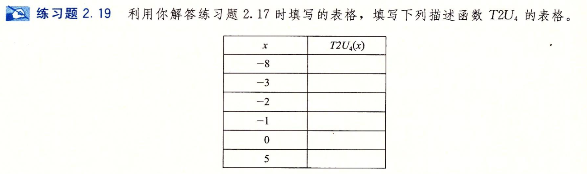

- #+BEGIN_PINNED
  Bryant, Randal E., and David R. O’Hallaron. 深入理解计算机系统. Translated by 龚奕利 and 贺莲. Third Edition. Beijing: 机械工业出版社, 2016.p50
  #+END_PINNED
- 前情 [[RE1A1C1--- 练习 2-17]]
- 
- ```text
  -8		8
  -3		13
  -2		14
  -1		15
   0		0
   5		5
  ```
-