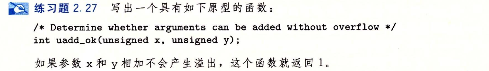

- #+BEGIN_PINNED
  Bryant, Randal E., and David R. O’Hallaron. 深入理解计算机系统. Translated by 龚奕利 and 贺莲. Third Edition. Beijing: 机械工业出版社, 2016.p62
  #+END_PINNED
- 
- ```C
  int uadd_ok(unsigned x, unsigned y) {
    return x+y > x;
  }
  ```
- 如果发生溢出，和的结果会小于任何一个加法单位。
-