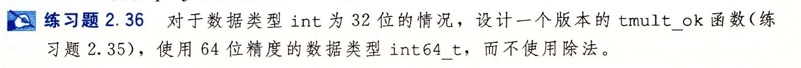

- #+BEGIN_PINNED
  Bryant, Randal E., and David R. O’Hallaron. 深入理解计算机系统. Translated by 龚奕利 and 贺莲. Third Edition. Beijing: 机械工业出版社, 2016. p69
  #+END_PINNED
- 
- ```C
  int tmult_ok(int x, int y) {
    int64_t op = x*y;
    int64_t cp = (int64_t)x * (int64_t)y;
    return op == cp;
  }
  ```
- 32位乘法的最大值可以用64位数字表示，所以只需要和64位乘法的结果比较就可以判断出是否发生了截断。