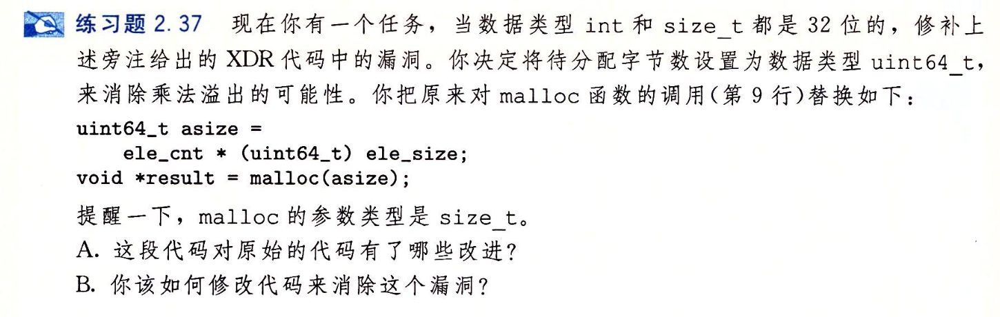

- #+BEGIN_PINNED
  Bryant, Randal E., and David R. O’Hallaron. 深入理解计算机系统. Translated by 龚奕利 and 贺莲. Third Edition. Beijing: 机械工业出版社, 2016. p70
  #+END_PINNED
- 
- A) 这段代码消除了计算`asize`时可能会产生的溢出，但忽略了`asize`作为`malloc`的参数时会被转换成`size_t`。假如`elt_cnt`转换成无符号数是`0x70000000`，`elt_size`转换之前是`0x70000000`，那么截断后最后的结果就是0。违背了初衷。
- B) 如果发生溢出并产生截断，抛出错误终止当前运行。
-