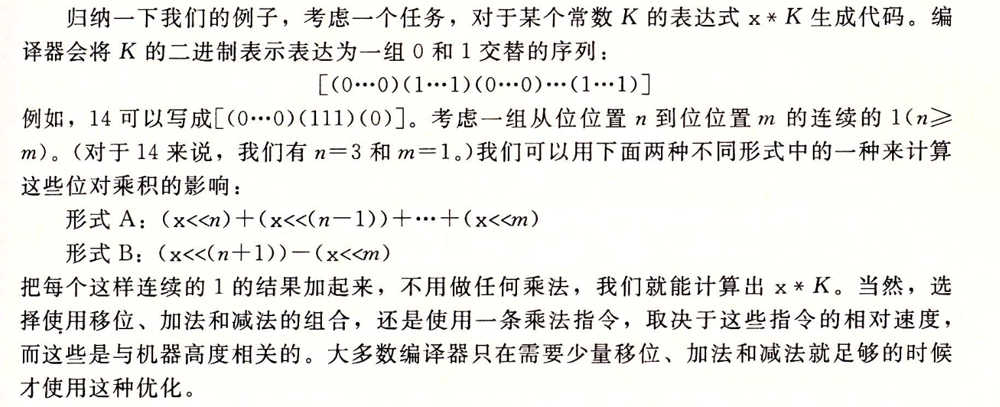
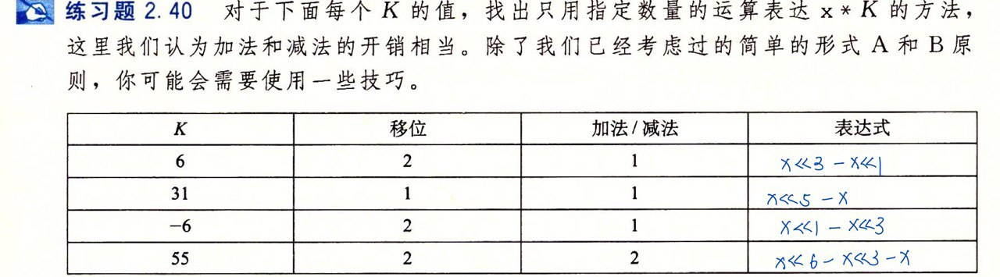

- #+BEGIN_PINNED
  Bryant, Randal E., and David R. O’Hallaron. 深入理解计算机系统. Translated by 龚奕利 and 贺莲. Third Edition. Beijing: 机械工业出版社, 2016. p71
  #+END_PINNED\
- 
- 为什么形式B成立？
	- 以14为例，它的二进制是`01110`，它的$n=3$，$m=1$。因为位位置$n$到位位置$m$是连续的，那它再加上一个$2^m$就可以得到$2^{n+1}$。所以易得形式B成立。
- ## 2-39
	- 
	- 将`x<<(n+1)`拆成`x<<n + x << n`
- ## 2-40
	- 
- ## 2-41
	- 
	- 哪种计算步骤少选择哪种。若连续的位只有2位，则选择加法和减法都可以。若连续的位有多位，使用B形式只进行2次移位，一次减法，而加法需要多次移位多次加法。
-