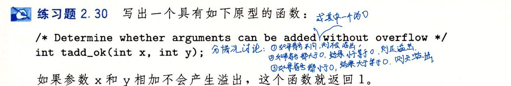

- #+BEGIN_PINNED
  Bryant, Randal E., and David R. O’Hallaron. 深入理解计算机系统. Translated by 龚奕利 and 贺莲. Third Edition. Beijing: 机械工业出版社, 2016. p65
  #+END_PINNED
- 
- ```C
  int tadd_ok(int x, int y) {
    if (x > 0 && y > 0) return x + y > 0;
    if (x < 0 && y < 0) return x + y < 0;
    return 1;
  }
  ```