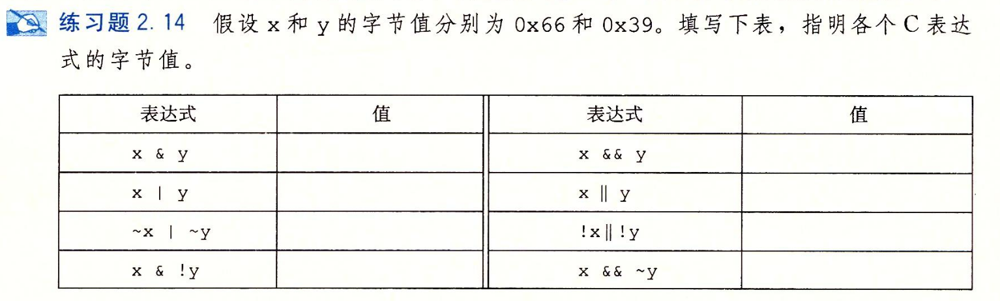

- #+BEGIN_PINNED
  Bryant, Randal E., and David R. O’Hallaron. 深入理解计算机系统. Translated by 龚奕利 and 贺莲. Third Edition. Beijing: 机械工业出版社, 2016.p40
  #+END_PINNED
- 
- ```text
   x &   y		0x20
   x |   y 		0x7F
  ~x |  ~y 		0xDF 		
   x &  !y 		0x00		//注意表达式右侧是"!"，这表明计算的是真值。
   x &&  y		0x01
   x ||  y		0x01
  !x || !y 		0x00
   x && ~y		0x01		//注意表达式右侧是"~"，这表明计算的是布尔值，结果右侧的真值仍为真。
  ```