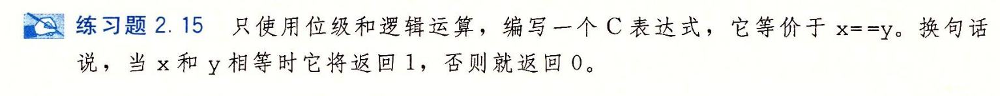

- #+BEGIN_PINNED
  Bryant, Randal E., and David R. O’Hallaron. 深入理解计算机系统. Translated by 龚奕利 and 贺莲. Third Edition. Beijing: 机械工业出版社, 2016.p40
  #+END_PINNED
- 
- `!(x^y)`
	- 异或可以让两个相等的数的结果为全0，在真值里表示假，所以在前面添加`!`
-