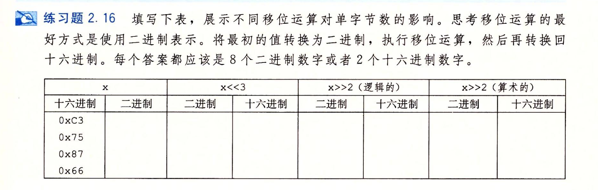

- #+BEGIN_PINNED
  Bryant, Randal E., and David R. O’Hallaron. 深入理解计算机系统. Translated by 龚奕利 and 贺莲. Third Edition. Beijing: 机械工业出版社, 2016.p41
  #+END_PINNED
- 
- ```text
  0xc3 11000011	00011000 0x18	00110000 0x30	11110000 0xF0
  0x75 01110101	10101000 0xA8	00011101 0x1D	00011101 0x1D
  0x87 10000111	00111000 0x38	00100001 0x21	11100001 0xE1
  0x66 01100110	00110000 0x30	00011001 0x19 	00011001 0x19
  ```