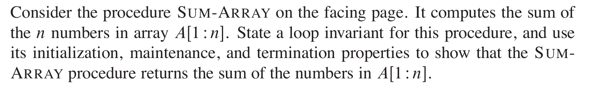
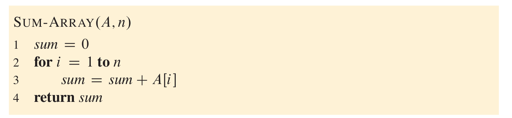

- #+BEGIN_PINNED
  Cormen, T. H., Leiserson, C. E., Rivest, R. L., & Stein, C. (2022). Introduction to algorithms (4th ed.). The MIT Press. c2.1
  #+END_PINNED
- 
- 
- *Loop Invariant:*
	- At the start of each iteration of the **for** loop of lines 2-3, the subarray $A[1:i-1]$ consist of the elements added to `sum`.
	- **Initialization**: Before the first loop.  `i = 1`, $A[1: 0]$ contains 0 elements, and `sum` equals to 0.
	- **Maintenance**: In the body of **for** loop, `sum` add current $A[i]$, and now $A[1: i]$  have the elements added to `sum` so far. Incrementing $i$ for the next iteration preserve the loop invariant.
	- **Termination**: Once $i$'s value exceeds $n$, the loop terminates. That is, $i$ equals $n+1$. Substituting $n+1$ for $i$ yields that the subarray $A[1:n]$ consist of the elements added to sum.  Hence, the algorithm is correct.
-