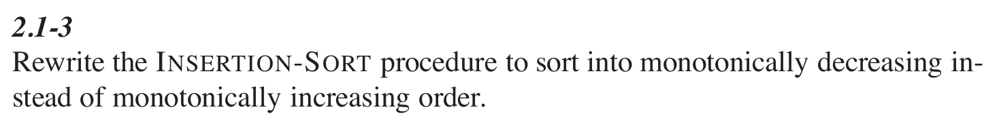

- #+BEGIN_PINNED
  Cormen, T. H., Leiserson, C. E., Rivest, R. L., & Stein, C. (2022). Introduction to algorithms (4th ed.). The MIT Press. c2.1
  #+END_PINNED
- 
- ```text
  for i = 2 to n:
  	key = A[i]
      j = i-1
      // 将较小的元素向后移
      while j > 0 and A[j] < key:
      	A[j+1] = A[j]
          j = j-1
      A[j+1] = key
  ```