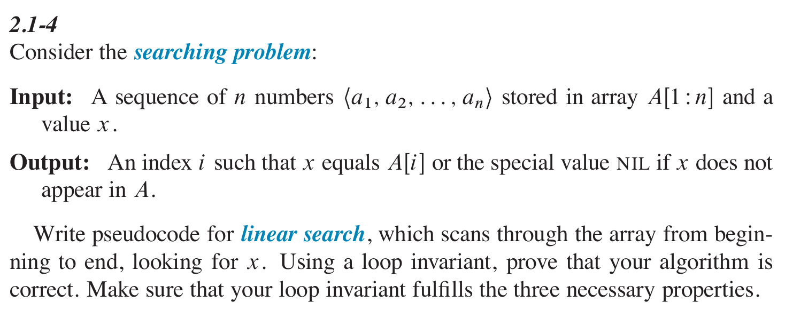

- #+BEGIN_PINNED
  Cormen, T. H., Leiserson, C. E., Rivest, R. L., & Stein, C. (2022). Introduction to algorithms (4th ed.). The MIT Press. c2.1
  #+END_PINNED
- 
- ```text
  for i = 1 to n:
  	if A[i] = x:
      	return i
  return NIL
  ```
- **Loop Invariant**:
	- At the start of each iteration of the `for` loop of lines 2-3, the elements in the subarray $A[1:i-1]$ are those whose index is not the return value.
	- **Initialization**: Before the first iteration, when $i = 1$. The subarray $A[1:i-1]$ doesn't contain any elements.
	- **Maintenance**: In the body of the `for` loop, check if $i$ is the return value. If it is, return it. If it is not, increment $i$ by 1 for the next iteration.
	- **Termination**: Once $i$'s value exceeds $n$, the loop terminates. And now $i$ equals to $n+1$. Substituting $n+1$ for $i$ in the word of loop invariant yields that the subarray $A[1:n]$ consists of the elements whose index is not the return value. Then return `nil`.
-