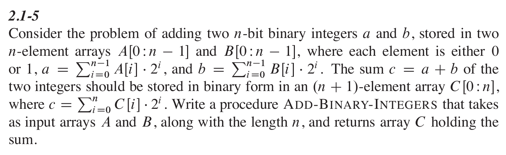

- #+BEGIN_PINNED
  Cormen, T. H., Leiserson, C. E., Rivest, R. L., & Stein, C. (2022). Introduction to algorithms (4th ed.). The MIT Press. c2.1
  #+END_PINNED
- 
- `ADD-BINARY-INTEGERS(A, B)`
- ```text
  carry = 0
  for i = 0 to n-1:
  	s = A[i] + B[i] + carry
  	c[i] = s % 2
      carry = s / 2
  c[n] = carry
  return c
  ```