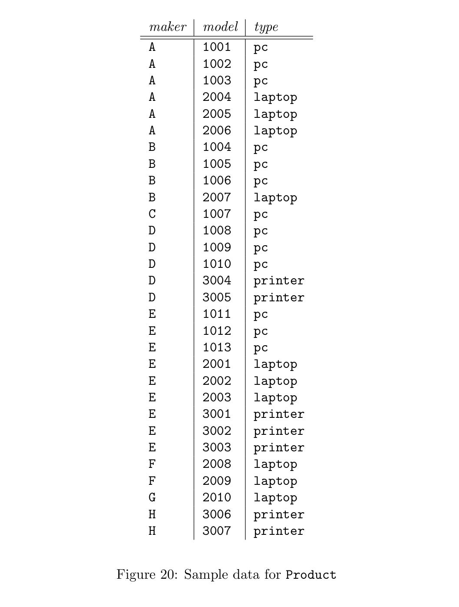
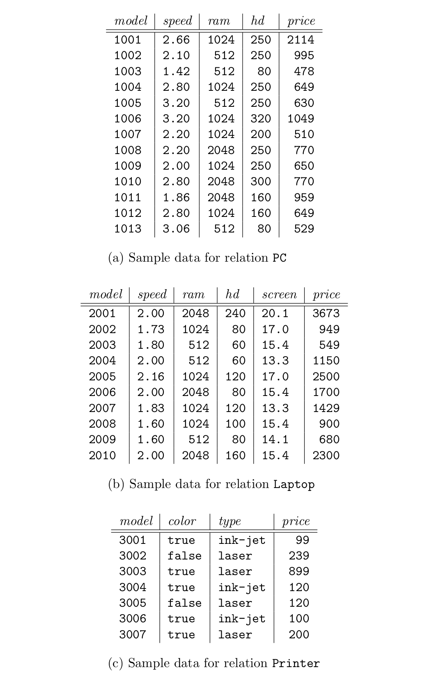

- #+BEGIN_PINNED
  Garcia-Molina, H., Ullman, J. D., & Widom, J. (2014). Database systems: the complete book (2nd ed.). Pearson. c4.14
  #+END_PINNED
- ## 4.1
	- {:height 305, :width 544}
	- {:height 470, :width 352}
	- {:height 474, :width 299}
	- a) What PC models have a speed of at least 3.00?
		- $\pi_{model}(\sigma_{speed \geq 3.00}(PC))$
	- b) Which manufacturers make laptops with a hard disk of at least 100GB?
		- $\pi_{maker}(\sigma_{hd \geq 100}(\text{Product} \Join \text{Laptop}))$
	- c) Find the model number and price of all products (of any type) made by manufacturer $B$.
		- $R(m,p) := \pi_{model, price}(\sigma_{maker='B'}(\text{Product} \Join \text{PC}))$
		- $S(m,p) := \pi_{model, price}(\sigma_{maker='B'}(\text{Product} \Join \text{Laptop}))$
		- $T(m,p) := \pi_{model, price}(\sigma_{maker='B'}(\text{Product} \Join \text{Printer}))$
		- $\text{Answer}(title, year) := R \cup S \cup T$
	- d) Find the model numbers of all color laser printers.
		- $\pi_{model}(\sigma_{color = true \text{ And } type = 'laser'}(\text{Printer}))$
	- e) Find those manufacturers that sell Laptops, but not PC’s.
		- $R(m) := \pi_{maker}(\sigma_{type='laptop'}(\text{Product}))$
		- $S(m) := \pi_{maker}(\sigma_{type = 'pc'}(\text{Product}))$
		- $\text{Answer}(maker) := R - S$
	- f) Find those hard-disk sizes that occur in two or more PC’s.
		- $R(m, h) := \pi_{model, hd}(\text{PC})$
		- $S(m, h) := \pi_{model, hd}(\text{PC})$
		- $\text{Answer}(hd) := \pi_{hd}(R \Join_{R.m \neq S.m \text{ And } R.hd = S.hd} S)$
	- g) Find those pairs of PC models that have both the same speed and RAM.
		- $R(m,s,r) := \pi_{model, speed, ram}(\text{PC})$
		- $S(m,s,r) := \pi_{model, speed, ram}(\text{PC})$
		- $\text{Answer}(R.m, S.m) := \pi_{R.m, S.m}(\sigma_{R.m < S.m}(R \Join_{R.m \neq S.m \text{ And } R.s = S.s \text{ And } R.r = S.r}))$
	- h) Find those manufacturers of at least two different computers (PC’s or laptops) with speeds of at least 2.80.
		- $\text{PJP}(maker, model, type, speed) := \pi_{maker, model, type, speed} (\text{Product} \Join \text{PC})$
		- $\text{PJL}(maker, model, type, speed) := \pi_{maker, model, type, speed} (\text{Product} \Join \text{Laptop})$
		- $\text{PCM} := \pi_{maker}(\sigma_{speed \geq 2.80 \text{ And } type = 'pc'} (\text{PJP} \cup \text{PJL}))$
		- $\text{LAM} := \pi_{maker}(\sigma_{speed \geq 2.80 \text{ And } type = 'laptop'} (\text{PJP} \cup \text{PJL}))$
		- $\text{Answer} := \text{PCM} \cap \text{LAM}$
	- i) Find the manufacturer(s) of the computer (PC or laptop) with the highest available speed.
		- $\text{PCS}(speed) := \pi_{speed}(\text{Product})$
		- $\text{LAS}(speed) := \pi_{speed}(\text{Laptop})$
		- $\text{SP} := \text{PCS} \cup \text{LAS}$
		- $A := \text{SP}$
		- $B := \text{SP}$
		- $C := \rho_{C(speed)}(\pi_{B.speed}(A \Join_{A.speed > B.speed} B))$
		- $\text{Max} := A - C$
		-
		-
		-
		-
		-
		-
		-
		-
		-
-